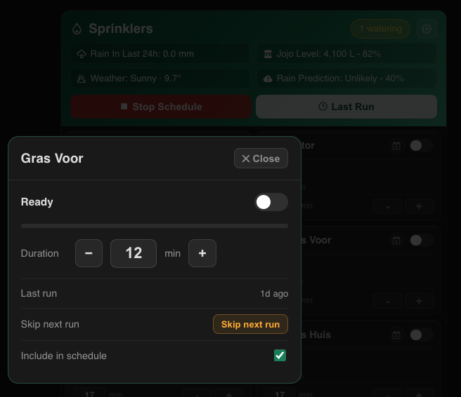

# 💧 Sprinkler Dash Card

A fully self-contained smart irrigation dashboard card for Home Assistant. Zero YAML scripting required — install the card, create your zone duration helpers, and everything else is configured and auto-created from within the card UI.


---

## Support the Project

[](https://buymeacoffee.com/hybridrcg)

---

## Screenshots

| Main Card | Zones & Info Bar | Schedule |
|---|---|---|
|  |  |  |

| Skip Next Run | Zone Expand Popup | Settings — General |
|---|---|---|
|  |  |  |

| Settings — Rules & Info Bar |
|---|
|  |

---

## Features

**Zero setup scripting**
- Auto-creates `script.sprinkler` on first load, built from your configured zones
- Auto-creates the Scheduler entity (defaults to Mon/Wed/Fri at 06:00)
- Auto-creates all required helper entities for skip zones and run history
- Script silently rebuilds whenever zones are changed, reordered, or toggled

**Zone control**
- Up to 12 configurable zones — 2-column grid with toggle, progress bar, countdown timer, and 1-minute adjustable duration
- Manual zone on with auto-stop timer — set duration before turning on, card stops the valve automatically
- Zone expand popup — tap any zone tile to open a large overlay with big controls (toggle, duration, skip, schedule toggle, last run)
- Zone last-run badge — shows "last: Xm/Xh/Xd ago" on each tile
- Zone run order indicator — during active schedule, sequence badges show green (current), ✓ done (persists 3h after run), amber (queued)
- Blue sequence badge — persists 8 hours after a manual zone run (stored in auto-created helper, survives reloads)
- Per-zone schedule toggle — tick/untick each zone to include or exclude from scheduled runs
- Per-zone skip next run — one-tap skip for the next run only, self-clearing after the schedule fires

**Schedule management**
- Built-in scheduler section — enable/disable, set run days, set run time with mobile-friendly HH/MM editor
- Smart next-run countdown — shows "Tonight 22:00", "Tomorrow 06:00", or "in 3h 45m"
- Start Schedule button — manually triggers the full zone sequence
- Stop Schedule button — immediately stops the script and closes all valves (with confirmation)

**Run history**
- Last Run popup — shows up to 12 previous runs with timestamp, zones watered, durations, and skipped zones
- One-tap "Set up run logging" creates a HA automation that records every run automatically, even when the card is not open

**Info bar**
- 4 configurable header slots — label, searchable MDI icon (7000+ with live preview), up to 2 sensors each
- Weather entities auto-render with condition and temperature
- Dual-sensor slots use unified dash separator (e.g. `4,650L - 97%`, `Possible - 55%`)
- All values title-cased automatically
- Tap any slot to open the entity detail popup

**Automation rules**
- Rain auto-disable — schedule turns off when rain exceeds configured mm threshold (slot turns yellow)
- Rain auto-restore — seasonal auto-adjust: 24h summer (Oct–Mar), 48h winter (Apr–Sep), with manual override and reset buttons
- Postpone countdown — shows "Resumes in Xh Xm" with rain/clear icon and which scheduled day will be skipped
- Jojo/tank low-level shutoff — all valves close immediately when tank drops below configured % (slot turns red)
- Confirmation popups — optional confirmation before any zone or schedule action

**Settings & persistence**
- All settings saved via HA websocket — survives hard refresh and works in sections layout
- Drag-to-reorder zones — script run order matches
- Searchable entity picker for all entity fields
- Version number visible in settings header

---

## Requirements

- Home Assistant 2023.1+
- [Scheduler Component](https://github.com/nielsfaber/scheduler-component) integration (via HACS)
- One `input_number` helper per zone for duration (see Step 2)

---

## Installation

### Option 1: HACS Custom Repository (Recommended - Takes 30 seconds)

1. **Open HACS** in Home Assistant
2. Click **Frontend** in the sidebar
3. Click the **⋮ (three dots)** in the top right corner
4. Select **"Custom repositories"**
5. Paste this URL: `https://github.com/HybridRCG/sprinkler-dash-card`
6. Select **"Lovelace"** as the category
7. Click **"Create"**
8. The card should now appear in HACS — click **Install**
9. **Hard refresh** your browser (Ctrl+Shift+R on Windows, Cmd+Shift+R on Mac, or open DevTools and long-press refresh)

**That's it!** You're done. Go to any dashboard and add the card with:
```yaml
type: custom:sprinkler-dash-card-v2
```

> **Note:** The card is pending approval for the HACS default store. Once approved, you'll be able to search and install directly without adding a custom repository. For now, custom repository is the fastest way to get started.

### Option 2: Manual Installation

1. Download `sprinkler-dash-card.js` from the [latest release](https://github.com/HybridRCG/sprinkler-dash-card/releases/latest)
2. Copy it to `/config/www/sprinkler-dash-card.js` on your Home Assistant server
3. Go to **Settings → Dashboards → Resources**
4. Click the **+ Create New Resource** button
5. Paste: `/local/sprinkler-dash-card.js`
6. Set **Resource Type** to **JavaScript Module**
7. Click **Create**
8. **Hard refresh** your browser

Now add the card to any dashboard:
```yaml
type: custom:sprinkler-dash-card-v2
```

---

## Setup Guide

### Step 1 — Add the card

```yaml
type: custom:sprinkler-dash-card-v2
```

That's the only YAML needed. All configuration is done inside the card via ⚙️.

---

### Step 2 — Create duration helpers

Go to **Settings → Helpers → Add → Number** and create one per zone:

| Helper | Min | Max | Step | Unit |
|---|---|---|---|---|
| `input_number.valve_1_time` | 0 | 60 | 1 | min |
| `input_number.valve_2_time` | 0 | 60 | 1 | min |
| ... | | | | |
| `input_number.valve_8_time` | 0 | 60 | 1 | min |

Create up to `valve_12_time` for up to 12 zones.

---

### Step 3 — Install Scheduler Component

Install **[Scheduler Component](https://github.com/nielsfaber/scheduler-component)** via HACS (Integration category).

The card auto-creates `script.sprinkler` and the Scheduler entity on first load. Adjust the run days and time directly on the card's Schedule section.

---

### Step 4 — Configure zones in ⚙️

- Set **Active Zones** (1–12)
- For each zone: set **Switch Entity** (valve switch) and **Duration Entity** (`input_number` from Step 2)
- Drag ⠿ to reorder — script run order matches
- Tick checkbox to include zone in scheduled runs
- Tap 💾 Save when done

---

### Step 5 — Configure settings in ⚙️

| Setting | Description |
|---|---|
| Nav path | Where tapping the title navigates |
| Rain sensor | Precipitation sensor in mm |
| Rain limit | mm above which schedule auto-disables |
| Rain restore | Hours before schedule re-enables after rain clears (default 48h) |
| Weather | Any `weather.*` entity |
| Jojo sensor | Water tank litres sensor |
| Jojo low % | Tank % below which all zones shut off immediately |
| Schedule switch | The `switch.schedule_*` entity (auto-detected) |

---

### Step 6 — Configure info bar in ⚙️

4 slots, each with: enable checkbox, label, MDI icon (searchable, live preview), Sensor 1, Sensor 2.

Layout auto-adjusts: 1=full, 2=50/50, 3=3-col, 4=2×2. Tap any slot to open entity detail.

---

### Step 7 — Automation rules in ⚙️

| Rule | Behaviour |
|---|---|
| Confirm before activating | Confirmation popup on all zone/schedule actions |
| Rain: Auto-disable schedule | Disables schedule when rain exceeds limit |
| Rain: Auto-restore schedule | Re-enables schedule after rain clears (configurable hours) |
| Jojo: Low-level zone shutoff | Closes all valves when tank drops below low % |

---

## Skip Next Run

Tap the 📅 calendar icon on any zone to skip it for the next run only. The zone shows an amber dashed border and "Skip next run" status. After the next schedule run, the skip clears automatically.

The card auto-creates `input_text.sprinkler_skip_zones` to track this — no setup needed.

---

## Run History

Tap **Last Run** to see recent schedule runs with timestamps, zone durations and skipped zones.

On first use, tap **⚙️ Set up run logging** to create a HA automation that records every run automatically — even when the card is not open. Stores up to 12 runs (approximately one month at 3 runs per week).

Tap **↻** in the Last Run header to refresh the data after a schedule completes (there is a short delay between the schedule finishing and the helper updating).

---

## Support

- [Issues](../../issues)
- [Home Assistant Community](https://community.home-assistant.io)

---

## Changelog

| Version | Changes |
|---|---|
| v2.9.68 | **POLISHED:** Last Run now clearly separates SCHEDULED RUNS from MANUAL RUNS. Scheduled zones show configured duration. Manual runs show a 🔧 icon and actual duration + timestamp. Crystal clear what was what! |
| v2.9.67 | **IMPROVED:** Last Run now anchors to scheduler's last_triggered time instead of 2-hour window. Shows all zones that ran since last scheduled run. Detects activity up to 24 hours back. Much more reliable zone activity tracking! |
| v2.9.66 | **NEW:** Last Run now shows duration! Manual runs display the duration you set (e.g., "12m • 1h ago"). Scheduled runs show configured duration from zone helpers. Fully tracks what each zone actually ran for. |
| v2.9.65 | **HOTFIX:** Fixed syntax error in v2.9.64 (apostrophe in string). Card now loads without configuration error! |
| v2.9.64 | **FIX:** Last Run now bulletproof with debug logging + fallback detection. Checks multiple attribute names, falls back to script.sprinkler. Shows zone activity timestamps in human-readable format (5m ago, 2h ago, etc). Check browser console for debug info if still not working. |
| v2.9.63 | **MAJOR:** Zone modal now has BIG +/− buttons for duration adjustment. Manual zone runs now AUTO-STOP after the set time, then restore original duration. No more manual turn-off needed! |
| v2.9.62 | **NEW:** Click any zone card to pop out zone details modal — shows status, duration, last activity, and quick turn on/off button. Brings back the zone expand feature! |
| v2.9.61 | Added version footer to settings panel for easy version checking |
| v2.9.60 | **COMPLETE REWRITE:** Last Run now bulletproof — reads from scheduler's `last_triggered` attribute instead of error-prone JSON storage. Detects zone activity from switch timestamps. No more "Could not read last run" errors! |
| v2.9.59 | **HOTFIX:** Fixed Jinja template syntax in script delay — changed from `max()` filter to simpler `or 1` logic. Zones now properly execute with correct delays |
| v2.9.58 | **FIX:** Zone runs now have minimum 1-minute delay (prevents stuck zones with 0-duration). UI now initializes with actual entity values instead of default 10 |
| v2.9.57 | **NEW:** Smart Resume — on HA restart, detects running zones and resumes from elapsed time (prevents over-watering). Automatically stops zones that exceeded duration, lets others finish normally |
| v2.9.56 | Fixed zone duration input increments — all zones now step by 1 minute (not 5) |
| v2.9.55 | Automation rule descriptions now dynamically read config values after save — Jojo shutoff threshold, rain threshold, and rain restore hours show correct saved values |
| v2.9.54 | Fixed time picker input width & height — no more cut-off numbers on desktop or mobile |
| v2.9.53 | **NEW:** Time picker is now a beautiful popout modal with large hour/minute spinners — tap time → modal appears → adjust with ▲/▼ or type → tap Save to close and apply changes |
| v2.9.52 | Fixed next-run countdown label — shows "in Xh Xm" instead of "Tonight" for clarity |
| v2.9.51 | Replaced broken time picker with proper dual-spinner UI for desktop & mobile |
| v2.9.50 | Removed buggy run history feature; simplified Last Run to static message |
| v2.9.35 | Seasonal rain restore — auto summer/winter hours, manual override, reset buttons |
| v2.9.34 | Skip day check — only shows skipped day if it is a scheduled run day |
| v2.9.33 | Rain postpone countdown shows which scheduled day will be skipped |
| v2.9.30 | Rain postpone countdown — Resumes in Xh Xm with live icon |
| v2.9.28 | Persistent rain auto-restore across HA restarts |
| v2.9.27 | Title shows Sprinklers — Postponed in blue when rain disables schedule |
| v2.9.26 | Friendly rain postponed message in schedule section |
| v2.9.23 | Countdown cleaner — relative time with day context |
| v2.9.18 | Smoother zone transition animations |
| v2.9.17 | Warn on unsaved settings changes before close |
| v2.9.16 | Scroll to settings panel on small screens |
| v2.9.15 | Configurable tick mark duration in settings |
| v2.9.14 | Last Run auto-refreshes after schedule completes |
| v2.9.11 | Fix false tick marks after HA restart |
| v2.9.4 | Zone expand popup; blue badge 8h after manual run |
| v2.9.9 | Manual zone timer persists across card reloads via stored stop time; tile toggle uses confirmWithTimer |
| v2.9.8 | Removed auto-stop from _updateZones — was cancelling scheduled runs |
| v2.9.7 | Zone expand popup uses proper manual timer with auto-stop; auto-stop buffer extended 2 min |
| v2.9.6 | Fixed "Tonight" label showing when run is less than 2 hours away |
| v2.9.5 | Refresh button in Last Run popup; fixed stale log entries |
| v2.9.4 | Zone expand popup (tap tile for big controls); blue badge 8h after manual run |
| v2.9.3 | Green tick on completed zones persists 3h after schedule finishes |
| v2.9.2 | Fixed premature manual zone auto-stop after card reload |
| v2.9.1 | Mobile time editor scrolls into view when keyboard opens |
| v2.9.0 | Replaced native time picker with HH/MM number inputs — no mobile scroll issues |
| v2.8.9 | Fixed auto-stop operator bug |
| v2.8.8 | Auto-stop manual zone timer even after card reload |
| v2.8.7 | Card reload no longer interrupts a running schedule |
| v2.8.4 | One-tap "Set up run logging" creates HA automation for persistent history |
| v2.8.3 | Ring buffer run history — 12 runs stored in auto-created helpers |
| v2.8.0 | Updated in-card setup guide with all current features |
| v2.7.9 | All zone duration steps set to 1 minute |
| v2.7.7 | Zone run order indicator fully working |
| v2.7.0 | Zone run order indicator; manual zone timer with auto-stop |
| v2.6.0 | Zone run order badges; manual zone timer; HACS validation |
| v2.5.5 | Mobile time edit — HH/MM number inputs |
| v2.5.0 | Stop Schedule button; Last Run popup; zone last-run badges; rain auto-restore |
| v2.4.0 | Per-zone skip next run; auto-creates skip helper |
| v2.3.0 | White section headings; title-case info bar values; unified dash separator |
| v2.2.0 | Confirmation popups; script delay format fixed |
| v2.1.0 | Settings persist via websocket |
| v2.0.0 | Auto-creates script and Scheduler; zone schedule toggle; sticky settings |
| v1.0.0 | Initial release |

---

[](https://buymeacoffee.com/hybridrcg)

---

## License

MIT © [HybridRCG](https://github.com/HybridRCG)
