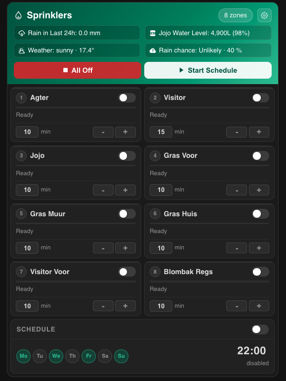
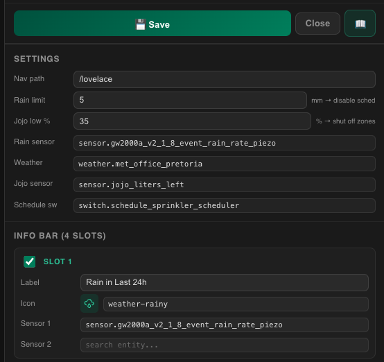
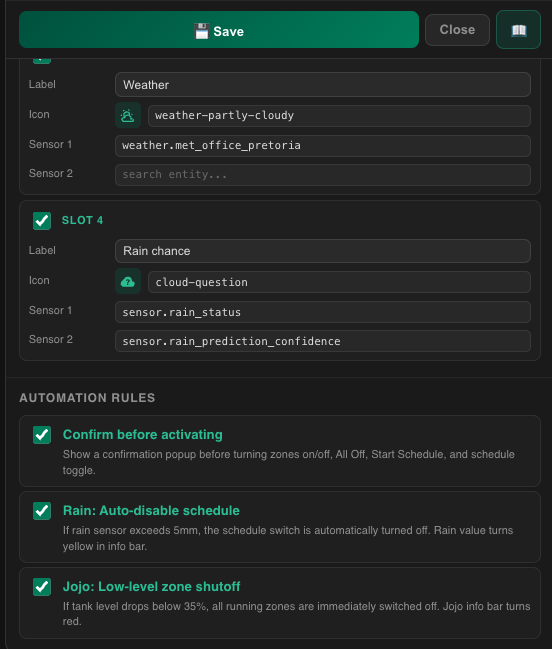
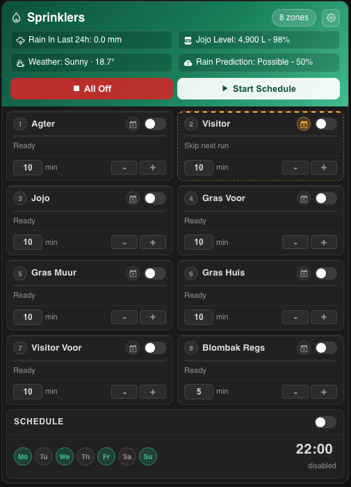
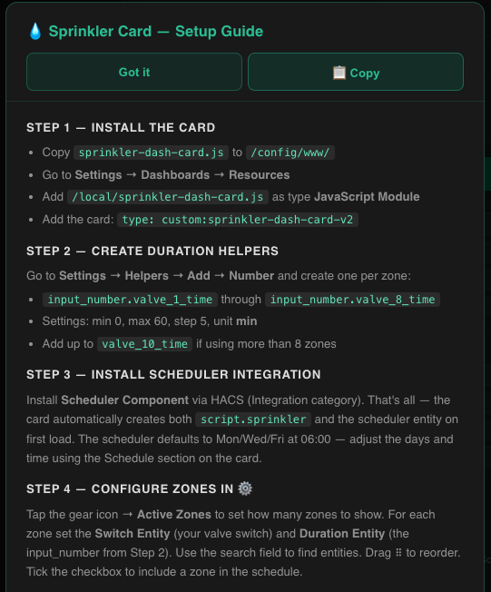
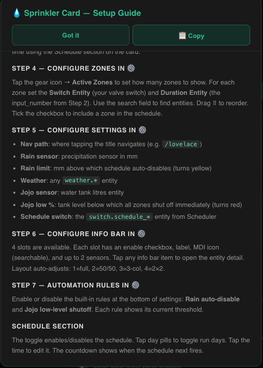

# 💧 Sprinkler Dash Card

A fully self-contained smart irrigation dashboard card for Home Assistant. Zero YAML scripting required — install the card, create your duration helpers, and everything else is configured and auto-created from the card UI.


---

## Support the Project

[](https://buymeacoffee.com/hybridrcg)

---

## Screenshots

| Main Card | Zones & Info Bar | Schedule |
|---|---|---|
|  |  |  |

| Skip Next Run | Settings — General | Settings — Info Bar & Rules |
|---|---|---|
|  |  |  |

---

## Features

- **Up to 12 configurable zones** — 2-column grid with toggle switch, progress bar, countdown timer, and adjustable duration
- **Confirmation popups** — tap any zone toggle, All Off, Start Schedule, or schedule toggle to get a confirmation dialog before anything activates; can be disabled in settings
- **Auto-creates everything** — on first load creates `script.sprinkler` and the Scheduler entity automatically; no manual scripting needed
- **Script auto-rebuilds** — whenever you change zones, reorder them, or toggle their schedule checkbox the script silently rebuilds in the background
- **Zone schedule toggle** — tick/untick each zone to include or skip it in scheduled runs
- **Skip next run (per zone)** — one-tap "skip next run" on any zone, self-clearing after the schedule (or Start Schedule) next fires
- **Built-in scheduler section** — enable/disable, set run days, set run time, shows next run countdown
- **4-slot configurable info bar** — label, searchable MDI icon, up to 2 sensors per slot; tap any slot to open the entity detail popup
- **Searchable entity picker** — find any HA entity by typing in all entity fields
- **MDI icon picker** — search 7000+ icons with live preview
- **Rain auto-disable** — when rain exceeds your configured mm threshold the schedule auto-disables (slot turns yellow)
- **Jojo/tank low-level shutoff** — when tank drops below your configured %, all running zones shut off immediately (slot turns red)
- **Automation rules panel** — enable/disable rain and Jojo rules individually; enable/disable confirmation popups
- **Drag-to-reorder zones** — reorder in settings; script run order matches
- **All Off** — cuts all zones in a single service call directly from the card
- **Navigation** — tap the card title to navigate to any HA view
- **Settings persist on hard refresh** — saved via HA websocket directly into the dashboard config
- **Fully UI-configurable** — one line of YAML, everything else in ⚙️ settings
- **HACS compatible**

---

## Installation

### Via HACS (Recommended)

1. Open HACS → Frontend
2. Click the three-dot menu → **Custom repositories**
3. Add `HybridRCG/sprinkler-dash-card` as category **Lovelace**
4. Search for "Sprinkler Dash Card" and install
5. Hard refresh your browser

### Manual

1. Download `sprinkler-dash-card.js` from the [latest release](../../releases/latest)
2. Copy to `/config/www/sprinkler-dash-card.js`
3. Go to **Settings → Dashboards → Resources**
4. Add `/local/sprinkler-dash-card.js` as type **JavaScript Module**
5. Hard refresh your browser

---

## Setup Guide

### Step 1 — Add the card

```yaml
type: custom:sprinkler-dash-card-v2
```

That's the only YAML you need. All configuration is done inside the card via the ⚙️ gear icon.

---

### Step 2 — Create duration helpers

Go to **Settings → Helpers → Add Helper → Number** and create one per zone:

| Helper | Min | Max | Step | Unit |
|---|---|---|---|---|
| `input_number.valve_1_time` | 0 | 60 | 5 | min |
| `input_number.valve_2_time` | 0 | 60 | 5 | min |
| `input_number.valve_3_time` | 0 | 60 | 5 | min |
| `input_number.valve_4_time` | 0 | 60 | 5 | min |
| `input_number.valve_5_time` | 0 | 60 | 5 | min |
| `input_number.valve_6_time` | 0 | 60 | 5 | min |
| `input_number.valve_7_time` | 0 | 60 | 5 | min |
| `input_number.valve_8_time` | 0 | 60 | 5 | min |

Create up to `valve_12_time` if using up to 12 zones.

---

### Step 3 — Install Scheduler integration

Install **[Scheduler Component](https://github.com/nielsfaber/scheduler-component)** via HACS (Integration category).

That's all — on first load the card automatically:
- Creates `script.sprinkler` built from your configured zones in sequence
- Creates the Scheduler entity (defaults to Mon/Wed/Fri at 06:00)

> Adjust the days and time directly on the card's Schedule section. The script silently rebuilds whenever you change zones.

---

### Step 4 — Configure zones in ⚙️

- Set **Active Zones** (1–12) — controls how many zones appear in the grid
- For each zone set the **Switch Entity** (valve switch) and **Duration Entity** (`input_number` from Step 2)
- Use the search field to find entities by typing
- Drag **⠿** to reorder — script run order matches zone order
- **Checkbox** next to each zone name — tick to include in scheduled runs, untick to skip

---

### Step 5 — Configure settings in ⚙️

| Setting | Description |
|---|---|
| Nav path | Where tapping the title navigates (e.g. `/lovelace`) |
| Rain sensor | Precipitation sensor in mm |
| Rain limit | mm threshold above which schedule auto-disables |
| Weather | Any `weather.*` entity |
| Jojo sensor | Water tank litres sensor |
| Jojo low % | Tank level % below which all zones shut off immediately |
| Schedule switch | The `switch.schedule_*` entity from Scheduler (auto-detected) |

---

### Step 6 — Configure info bar in ⚙️

4 slots in the header info bar. Each slot has:

| Field | Description |
|---|---|
| Enable | Checkbox to show/hide the slot |
| Label | Text shown before the value |
| Icon | Searchable MDI icon with live preview |
| Sensor 1 | Primary value (`weather.*` entities auto-render with conditions + temp) |
| Sensor 2 | Optional second value appended inline |

**Tap any info bar item** to open the entity detail popup in HA.

Layout auto-adjusts based on enabled slots: 1 = full width, 2 = 50/50, 3 = 3 equal columns, 4 = 2×2 grid.

---

### Step 7 — Automation rules in ⚙️

At the bottom of settings, three rules can be individually toggled:

| Rule | Behaviour |
|---|---|
| Confirm before activating | Shows a confirmation popup before turning zones on/off, All Off, Start Schedule, and schedule toggle. Disable to skip confirmations entirely. |
| Rain: Auto-disable schedule | Rain sensor ≥ limit → schedule turns off automatically, slot turns yellow |
| Jojo: Low-level zone shutoff | Tank level < low % → all running zones switch off immediately, slot turns red |

---

## Skip Next Run (per zone)

Tap the **calendar-remove** icon next to any zone's name to mark it as skipped for the next run only — no confirmation needed, tap again to cancel. The zone gets an amber dashed border and shows "Skip next run" in place of "Ready".

When the schedule (or **Start Schedule**) next runs, that zone is bypassed entirely and the skip **automatically clears itself** — back to normal for the run after that. This is useful when you've watered a bed manually and don't want the automated run to water it again that night.

No setup required — the card auto-creates a small `input_text.sprinkler_skip_zones` helper on first load to track this. If a zone's switch entity changes or the zone is removed, any stale skip entry is simply ignored (harmless).

---

## How All Off and Start Schedule work

- **All Off** — calls `switch.turn_off` on all active zone switches simultaneously. No script involved. Shows a confirmation popup first (if enabled).
- **Start Schedule** — fires `script.sprinkler` which the card auto-created. Zones run sequentially in order, each for their configured duration. Only zones with the schedule checkbox ticked are included. Shows confirmation popup first (if enabled).
- **Zone toggle** — turns a single valve on or off. Shows confirmation with zone name. Turning off uses a red confirm button.
- **Schedule toggle** — enables or disables the Scheduler entity. Shows confirmation first.

---

## Schedule Section

- Toggle to enable/disable the scheduled run
- Tap day pills (Mo–Su) to toggle which days the schedule runs
- Tap the time display to edit the run time
- Countdown shows how long until the next scheduled run

---

## Settings Persistence

All settings are saved directly into the HA dashboard config via websocket — they survive hard refresh and browser changes. This works in all HA dashboard layouts including the sections layout.

---

## Support

- [Issues](../../issues)
- [Home Assistant Community](https://community.home-assistant.io)

---

## Changelog

| Version | Changes |
|---|---|
| v2.7.5 | Version number in sticky header; settings sections all visible; push.sh updated |
| v2.7.4 | Version number visible in settings sticky header; push.sh now picks up from Downloads |
| v2.7.3 | Version number in settings made more visible |
| v2.7.2 | Fixed helper auto-creation API; Last Run fits 255 chars; zone run order indicator fixed; version in settings |
| v2.7.1 | Zone run order indicator fixed; Last Run data fits within 255 char HA limit; version number in settings footer |
| v2.7.0 | Zone run order indicator (green=current, ✓=done, amber=queued); manual zone timer with auto-stop |
| v2.6.0 | Zone run order indicator — sequence badges colour green (current), ✓ grey (done), amber (queued) during active schedule; manual zone timer — tap zone toggle to start with auto-stop after configurable minutes |
| v2.5.5 | Mobile time edit fix — replaced native time picker with HH/MM number inputs; green ✓ to confirm, grey ✕ to cancel |
| v2.5.4 | Schedule time edit now requires ✓ confirm (no accidental saves); time input widened so minutes are visible |
| v2.5.3 | Restored 1-min duration steps; Last Run popup properly formatted with Watered/Skipped sections |
| v2.5.2 | Smarter next-run countdown — shows Tonight/Tomorrow labels instead of just day name |
| v2.5.1 | Last Run button matches Start Schedule style; compact popup header with inline Close button |
| v2.5.0 | Stop Schedule button (replaces All Off); Last Run popup with per-zone details; zone last-run badges; rain auto-restore after 48h |
| v2.4.2 | Duration +/- buttons now increment by 1 minute instead of 5 for fine-grained control |
| v2.4.1 | Fixed schedule time editing — `stop: null` was crashing the Scheduler integration's time validator, causing a 500 error on save |
| v2.4.0 | Per-zone "skip next run" — one-tap, self-clearing skip for the next scheduled run; auto-creates `input_text.sprinkler_skip_zones` helper |
| v2.3.0 | Section headings now white/bold for better visibility; Active Zones controls merged into Zones header line (right-justified); Automation Rules hint text added; title-case all info bar values; unified dash separator for dual sensors |
| v2.2.5 | Title-case all info bar sensor values (e.g. `partly cloudy` → `Partly Cloudy`) |
| v2.2.4 | Unified dual-sensor display — all slots use dash separator (e.g. `4,650L - 93%`, `Possible - 55%`); removed space before `%` unit |
| v2.2.2 | Max zones increased to 12; screenshots in README |
| v2.2.0 | Confirmation popups on all actions (zones, All Off, Start Schedule, schedule toggle); enable/disable in rules; script delay format fixed (was hours, now minutes) |
| v2.1.0 | Settings save via websocket; frozen config deep-clone fix; all settings persist on hard refresh |
| v2.0.0 | Auto-creates `script.sprinkler` and Scheduler entity on first load; zone schedule checkbox; automation rules panel; sticky setup instructions; bigger fonts; info bar items clickable |
| v1.8.0 | Auto-rebuild script on zone changes; setup instructions modal |
| v1.7.0 | Info bar enable/disable per slot; MDI icon picker; smart grid layout (1/2/3/4 slots) |
| v1.6.0 | 4 configurable info bar slots; Jojo low % setting; nav_path persistence fix |
| v1.5.0 | Max zones 10; entity search fixed; Switch + Duration Entity per zone in settings |
| v1.4.0 | Rain auto-disable; Jojo level + % display; threshold settings |
| v1.3.0 | Full settings panel; drag-to-reorder; entity search; nav path |
| v1.2.0 | Built-in scheduler section; progress bar; live duration countdown |
| v1.1.0 | All Off direct switch calls; +/- duration buttons; zone sequence numbers |
| v1.0.0 | Initial release |

---

[](https://buymeacoffee.com/hybridrcg)

---

## License

MIT © [HybridRCG](https://github.com/HybridRCG)
